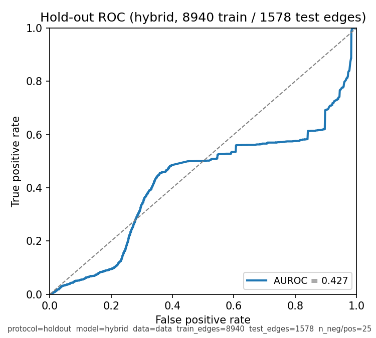
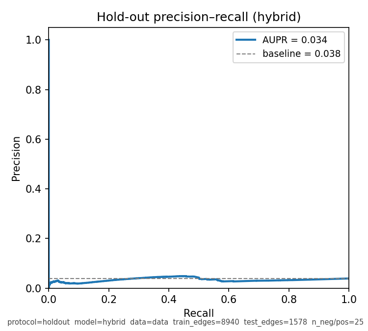
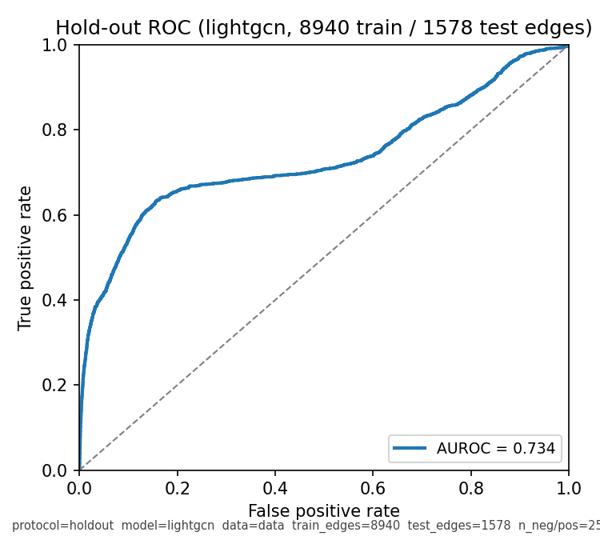
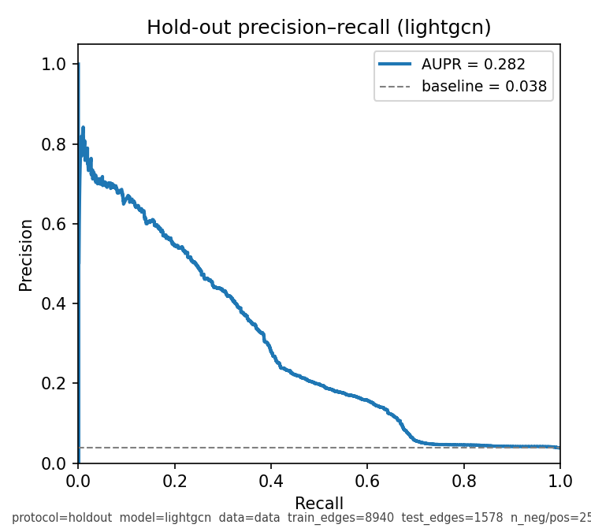
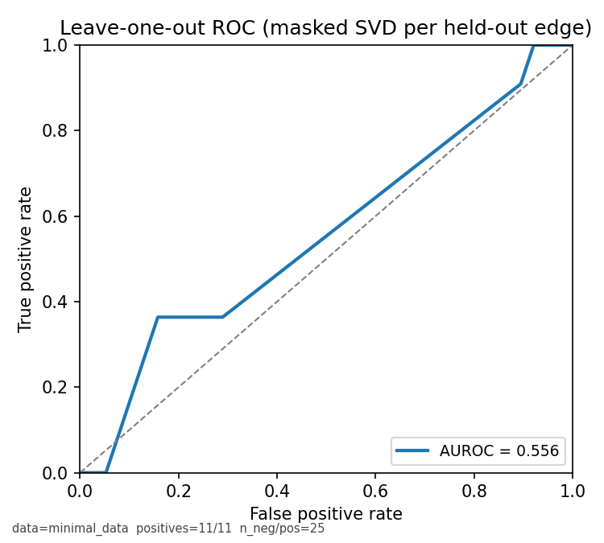
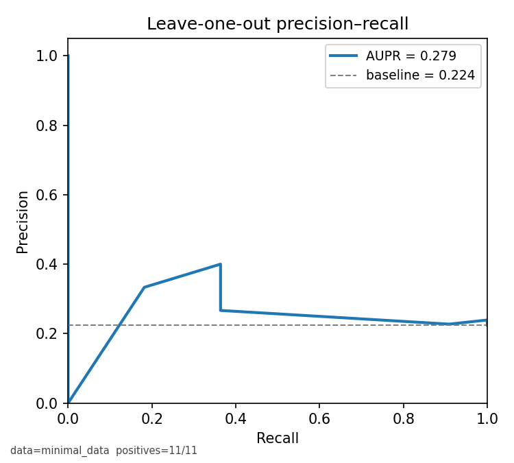
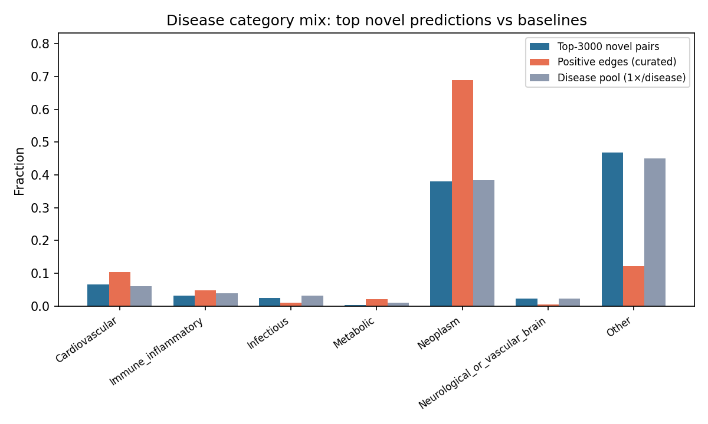
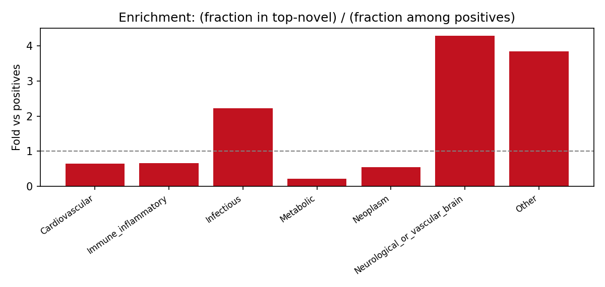

# lncRNA–disease link exploration

End-to-end pipeline: **LncRNADisease v3.0** → bipartite graph → **joint embeddings** (matrix factorization, small GNN, or **bipartite LightGCN**) → **held-out / LOO evaluation** (ROC + **PR**, optional **ranking** of masked edges) → **bias audits** (disease category mix, **hub degree**). **Flask** serves the **full** ingested graph; with a trained checkpoint it uses **LightGCN** dot-product scores by default.

---

## Phase 2 — Joint embeddings (same latent space for lncRNAs and diseases)

**Goal:** map lncRNAs and diseases into \(\mathbb{R}^d\) so **dot products** (or equivalently cosine after normalizing) reflect association propensity.

| Path | Implementation | Notes |
|------|----------------|--------|
| **A. Matrix factorization** | `src/models_mf.py` + `train_logistic_mf` in `src/learned_edge_models.py` | Learned embeddings, BCE on train edges + negatives. |
| **B. LightGCN (recommended GNN-style)** | `src/lightgcn_bipartite.py` | **No PyG/DGL required**: symmetric-normalized incidence \(R\), \(K\) linear propagation layers, **only layer-0** embeddings trained; final representation is **mean of layers** (He et al., LightGCN idea). Suited to **bipartite** user–item / lncRNA–disease graphs. |
| **C. Tiny MLP GNN** | `src/models_gnn.py` + `train_tiny_gnn` | 2-hop tanh message passing; heavier than LightGCN. |
| **Fast baseline (no gradient)** | `flask_tool/ranker.py` `HybridLinkScorer` | Truncated SVD + deterministic co-occurrence term. |

**Train LightGCN on the whole dataset** (writes `checkpoints/lightgcn_full.pt`; large file is **gitignored** — run locally before demo):

```bash
pip install -r requirements.txt
python scripts/train_lightgcn_full.py --data-dir data --epochs 250 --dim 64 --layers 3
```

**Flask** auto-loads `checkpoints/lightgcn_full.pt` when present (`LNC_USE_LIGHTGCN=0` disables; `LNC_LIGHTGCN_CKPT=/path/to.pt` overrides).

---

## Phase 3 — Evaluation: biology vs bias

1. **Mask held-out edges** — Default **85% / 15%** random **edge** split: train only on \(Y_{\text{train}}\), evaluate on **test positives** vs sampled negatives (**ROC + PR**). On **very sparse** graphs, **PR curves are often more informative** than ROC; both are plotted.

2. **Where masked 1s rank** — `--ranking-report` computes **MRR** and **HR@10 / HR@50** for each test edge \((i,j)\): among all diseases **not** linked to \(i\) in \(Y_{\text{train}}\), how high is the **true** disease \(j\)?

   ```bash
   python scripts/eval_loo_link_prediction.py --data-dir data --protocol holdout --model lightgcn \
     --train-fraction 0.85 --epochs-lightgcn 200 --ranking-report --out-dir figures
   ```

3. **Annotation / hub bias** — Dense “celebrity” nodes (e.g. MALAT1, common cancers) can dominate scores.
   - **Category:** `scripts/category_bias_audit.py` — top novel pairs vs positive-edge category histogram.
   - **Hubs:** `scripts/hub_degree_audit.py` — compares \(\log(1 + \deg_{\text{lnc}}\cdot\deg_{\text{dis}})\) for top novel pairs vs random absent pairs; **ratio ≫ 1** suggests **popularity** (not necessarily wrong, but must be reported).

4. **Leave-one-out** — Still supported via `--protocol loo` (subsample with `--loo-threshold`); expensive for learned models.

---

## What we built (step by step)

1. **Problem framing** — Treat an lncRNA–disease resource as a **bipartite graph** (lncRNAs × diseases, edges = reported associations).

2. **LncRNADisease v3.0 integration**
   - **`scripts/fetch_lncrnadisease_v30.py`** — Downloads official bulk files from [LncRNADisease3](http://www.rnanut.net/lncrnadisease/index.php/home/info/download) (default: `website_simple_data.csv`).
   - **`scripts/ingest_lncrnadisease_v30.py`** — Builds `associations.csv`, `diseases.csv`, and `lncrnas.csv`: human **Homo sapiens** + **LncRNA** rows, unique edges, stable disease IDs, and coarse **keyword disease categories** (for bias-style summaries; not MeSH).

3. **Data loader** — **`src/dataio.py`** loads the three CSVs into a sparse **0/1 incidence matrix** `Y` plus ID/name/category maps.

4. **Ranking model (portal)** — **`flask_tool/app.py`**: if **`checkpoints/lightgcn_full.pt`** exists, loads **bipartite LightGCN** embeddings and ranks by **dot product** on the **full** graph; otherwise **`HybridLinkScorer`** (SVD + co-occurrence) from **`flask_tool/ranker.py`**. Data default **`./data/`**, fallback **`examples/minimal_data/`**. Training the checkpoint is **offline** (`scripts/train_lightgcn_full.py`); the UI is **exploratory** (not the masked evaluation split).

5. **Synthetic demo generator** — **`scripts/generate_demo_data.py`** can emit a toy bipartite graph (optional).

6. **Runnable portal** — **`run_flask.py`** and **`wsgi.py`**, templates under **`flask_tool/templates/`**, styles in **`flask_tool/static/`**.

7. **Link-prediction metrics** — **`scripts/eval_loo_link_prediction.py`**: **`--protocol holdout`** (mask **15%** of edges by default), **`--model lightgcn|mf|gnn|hybrid|svd`**, ROC/PR plots, optional **`--ranking-report`** (MRR, HR@10/50). **`src/lightgcn_bipartite.py`**, **`src/learned_edge_models.py`**, **`src/models_mf.py`**, **`src/models_gnn.py`**.

8. **Bias audits** — **`scripts/category_bias_audit.py`** (category histogram of top novel pairs vs positives / disease pool). **`scripts/hub_degree_audit.py`** (degree product of top novel pairs vs random null — **hub / popularity** check). Optional **`--checkpoint`** on the hub script to audit **LightGCN** scores.

9. **Repository hygiene** — **`requirements.txt`**, **`environment.yml`**, **`.gitignore`**, **`LICENSE` (GPL-3.0)**, and this **README**.

Cite the **LncRNADisease v3.0** database and its paper when using their downloads (e.g. Zhang *et al.*, *NAR*, [PMC10767967](https://pmc.ncbi.nlm.nih.gov/articles/PMC10767967/)).

---

## Biological readout: graph structure vs annotation bias

The substantive question is not a single AUC number but **how the knowledge graph behaves under scrutiny**:

1. **Generalisation of local structure** — **Hold-out** / **LOO** ROC/PR plus optional **ranking** of masked positives among **all train-unlinked diseases** for that lncRNA. **PR-AUC** is stressed for **extreme sparsity** (mostly zeros). Weak metrics can mean hard biology, noisy curation, or model limits.

2. **Annotation bias vs “biology-shaped” structure** — Even when AUC is modest, **where** the model puts its highest novel mass matters. If top novel pairs **recapitulate the same disease-category histogram as existing positives** (e.g. dominated by neoplasms because cancer lncRNA papers dominate the corpus), predictions may be **chasing literature depth** more than a balanced biological prior. **`scripts/category_bias_audit.py`** plots the category mix of the **top‑K absent edges** next to baselines (positives vs disease pool) and a **fold-change vs positives** panel. **Interpret cautiously:** keyword buckets are imperfect; some concentration is expected for real biology; the comparison is a **sanity screen**, not proof of bias.

**Example (this repo, full v3 ingest, hybrid model, seed 42):** among **3000** top-scoring novel pairs, **Neoplasm** accounts for **~38%** of hits vs **~69%** of curated positives (**~0.55×** fold vs positives), while **Other** and **Neurological…** are enriched relative to positives — i.e. the model is **not** simply reproducing the cancer-heavy marginal of the database for this run. Re-run the script after re-ingest; numbers will move.

### Hold-out ROC/PR (full graph, default protocol)

**Protocol.** All edges from **`data/associations.csv`** (after ingest) are shuffled (seed **42**), **85%** build **`Y_train`**, **15%** are **test** positives. Fit the chosen **`--model`** **once** on `Y_train` (hybrid/SVD: closed-form; **mf/gnn**: gradient steps on training edges + negatives). For each test edge \((i,j)\), score it as a positive; sample **`--n-neg`** negatives from diseases with no **training** edge to lncRNA \(i\), excluding \(j\). Pool and compute ROC / PR — this is the direct **“how well are held-out associations recovered?”** readout.

**Learned embeddings (PyTorch):**

```bash
python scripts/eval_loo_link_prediction.py --data-dir data --protocol holdout --model lightgcn \
  --epochs-lightgcn 200 --n-components 64 --lightgcn-layers 3 --ranking-report --out-dir figures
python scripts/eval_loo_link_prediction.py --data-dir data --protocol holdout --model mf --epochs-mf 120 --n-components 32 --out-dir figures
python scripts/eval_loo_link_prediction.py --data-dir data --protocol holdout --model gnn --epochs-gnn 60 --n-components 32 --out-dir figures
```

**Re-evaluated hold-out (same split: 85% train / 15% test, seed 42, full v3 ingest).** The old **hybrid (SVD+co-occurrence)** baseline is weak on strict edge masking; **LightGCN** (learned joint embeddings on `Y_train`) recovers held-out links much better:

| Model | AUROC | AUPR | MRR | HR@10 | HR@50 |
|--------|-------|------|-----|-------|-------|
| Hybrid | 0.427 | 0.034 | 0.007 | 0.3% | 1.7% |
| **LightGCN** (`dim=64`, `layers=3`, `epochs=120`) | **0.734** | **0.282** | **0.201** | **41%** | **62% |

*MRR / HR@* are from `--ranking-report`: each test edge \((i,j)\) is ranked among diseases **not** linked to \(i\) in training (~400 candidates per row). PR-AUC is much more informative than ROC under this sparsity.

Hybrid (baseline) ROC/PR:





LightGCN ROC/PR (same protocol as table above):





**Regenerate** (requires **`data/`** from fetch + ingest):

```bash
pip install -r requirements.txt
python scripts/fetch_lncrnadisease_v30.py   # if needed
python scripts/ingest_lncrnadisease_v30.py  # if needed
python scripts/eval_loo_link_prediction.py --data-dir data --protocol holdout --model hybrid --out-dir figures
python scripts/eval_loo_link_prediction.py --data-dir data --protocol holdout --model lightgcn \
  --n-components 64 --lightgcn-layers 3 --epochs-lightgcn 120 --ranking-report \
  --roc-name holdout_lightgcn_roc.png --pr-name holdout_lightgcn_pr.png --out-dir figures
```

**Toy graph only:** `python scripts/eval_loo_link_prediction.py --data-dir examples/minimal_data --protocol holdout --out-dir figures`

### Leave-one-out ROC/PR (subsampled on full graph)

One **refit per held-out positive** is expensive. The figures below use **`--loo-threshold 350`** (350 positives, seed **42**). For a full LOO over ~10k edges use **`--all-loo`** and expect a long run.

| Metric (LOO, hybrid, 350 positives) | Value |
|-------------------------------------|-------|
| AUROC | 0.410 |
| AUPR | 0.032 |





```bash
python scripts/eval_loo_link_prediction.py --data-dir data --protocol loo --loo-threshold 350 --seed 42 --out-dir figures
```

### Category mixture of top novel predictions

```bash
python scripts/category_bias_audit.py --data-dir data --top-k 3000 --out-figure figures/category_novel_enrichment.png
python scripts/hub_degree_audit.py --data-dir data --top-k 3000
python scripts/hub_degree_audit.py --data-dir data --checkpoint checkpoints/lightgcn_full.pt
```





---

## Quick start (clone from GitHub)

```bash
git clone https://github.com/shubhamc-iiitd/lncrna_disease_pred.git
cd lncrna_disease_pred
python3 -m venv .venv
source .venv/bin/activate   # Windows: .venv\Scripts\activate
pip install -r requirements.txt
python scripts/fetch_lncrnadisease_v30.py
python scripts/ingest_lncrnadisease_v30.py
python scripts/train_lightgcn_full.py --data-dir data   # optional; CPU may take several minutes
python run_flask.py
```

Open **http://127.0.0.1:5000** in a browser. With `data/` present, the server uses it **by default**. If **`checkpoints/lightgcn_full.pt`** exists, rankings use **LightGCN**; set `LNC_USE_LIGHTGCN=0` to force the hybrid baseline. Override data path with:

```bash
export LNC_DATA_DIR=/absolute/path/to/folder_with_three_csvs
python run_flask.py
```

Alternative (Flask CLI):

```bash
export PYTHONPATH="$PWD"
flask --app wsgi run --debug
```

The folder must contain `associations.csv`, `diseases.csv`, and `lncrnas.csv` (see `src/dataio.py`).

## LncRNADisease v3.0 data (ingest only)

```bash
pip install -r requirements.txt
python scripts/fetch_lncrnadisease_v30.py
python scripts/ingest_lncrnadisease_v30.py
```

## Repository layout

| Path | Role |
|------|------|
| `run_flask.py` | Start the Flask server |
| `wsgi.py` | `flask --app wsgi run` |
| `flask_tool/` | App, templates; hybrid or **LightGCN** checkpoint scoring |
| `checkpoints/` | `lightgcn_full.pt` after `train_lightgcn_full.py` (default gitignored) |
| `scripts/` | Fetch/ingest, **`train_lightgcn_full.py`**, metrics, **hub_degree_audit**, category audit, synthetic data |
| `src/lightgcn_bipartite.py` | Bipartite LightGCN train + checkpoint I/O |
| `src/dataio.py` | Load CSVs into a sparse bipartite matrix |
| `data/` | Default location for ingested v3.0 CSVs (not always committed; see `.gitignore`) |
| `examples/minimal_data/` | Tiny demo graph if `data/` is missing |
| `figures/holdout_*.png`, `figures/holdout_lightgcn_*.png`, `figures/loo_*.png` | Hold-out ROC/PR (hybrid vs LightGCN); LOO subsampled unless `--all-loo` |
| `figures/category_novel_enrichment*.png` | Top-novel disease-category mix vs baselines |

## Push to GitHub

```bash
git init
git add .
git commit -m "Add Flask lncRNA–disease portal and LncRNADisease v3 ingest"
git branch -M main
git remote add origin https://github.com/shubhamc-iiitd/lncrna_disease_pred.git
git push -u origin main
```

## License

This project is licensed under the **GNU General Public License v3.0** — see the [`LICENSE`](LICENSE) file.
